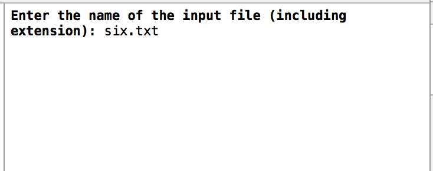
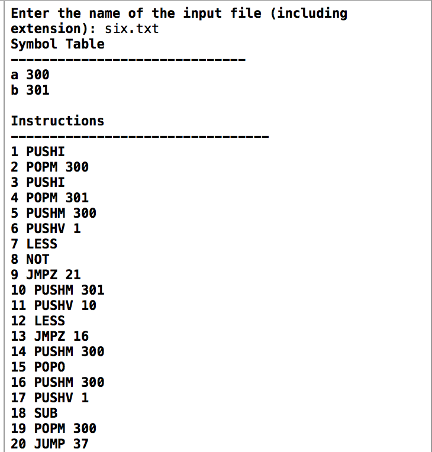

# Compiler-323-Project
<h2>Summary</h2>
Final version of the compiler project from CPSC 323 (November 2014). The project is coded in C++.

This is the final version of a semester-long project from my CPSC 323 course (Programming Language and Translation).
I worked together with my friend and classmate, <a href="https://github.com/yuuuri" target="_blank">Yuri</a>.

The compiler consists of a lexical analyzer, parser, and translator, all of which takes a pseudo programming language 
and translates it into pseudo assembly code. The compiler reads the code from an external file (e.g. text file).
It then parses through the code and translates it into assembly code (or generates error messages if there are syntax errors.

Attached to this repo is the full grammar of the language along with some sample input files.

<h2>How to Run</h2>
Clone the project into your desktop.

Place the file with your code in the same directory as the main.cpp file.

Run the program (main.cpp).

Type in the name of the file containing your code.

Program will print out assembly code translation.

<h2>Disclaimer</h2>
I did not create the programming language or assembly language used for this project. All credit for the languages goes to
Professor Mark Murphy at CSUF.

<h2>Screenshots</h2>

